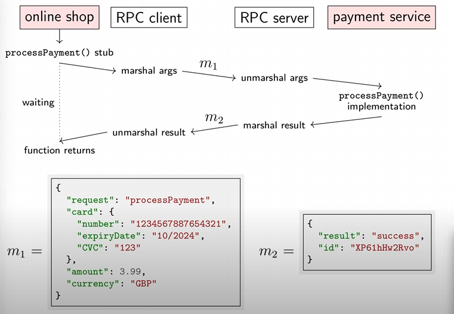

# Distributed Systems

```
These lectures are by Martin Kleppman, 
the author of DDIA(Designing Data-Intensive Applications )
```

## Motivation
- 학회 사람들이 GPU 병렬 프로그래밍 스터디를 한다고 했고, 존경하는 과 동기의 추천으로 CS basic을 다시 re-visit하게 되었다.
- CS 전공 중 내게 부족한 것 :: 코딩 경험 + 실제 삽질 경험.  
- 분산 병렬처리는 평생에 걸쳐 공부하고 싶은 소재였기에, MLOps를 짚게 될 언젠가를 위하여 공부하게 되었다. 


## Lec 01 : 
(First lec : )
```
Keyword: Distributed systems, Latency, Bandwidth, RPC, SoA, InterfaceDefinitionLanguage(IDL)
```

- 강의의 전반부는 Concurrency란 컨셉에서, 한 컴퓨터 노드 내에서의 통신을 다루고 있음
- 한 프로세스 내의 여러 스레드는 같은 주소공간을 공유하기 때문에 Variable, Pointer, Reference 등의 공유가 편함 
- 만약 여러 컴퓨터가 관여된 시스템이라면 어떨까? 근본적으로, 이는 네트워크와 관련이 있다. `여러 노드가 메시지를 통해 통신하는 시스템`을 분산 시스템으로서 정의할 수 있다.

- 오늘날의 `Distributed systems` 는 Multiple Node + Multiple program
- 어느 대가의 표현을 빌리자면.."존재조차 몰랐던 컴퓨터의 결함이 나의 컴퓨터를 고장나게 만든다?" 이게 분산 시스템임. 

### Why distributed?
- 구조적으로 이미 분산 시스템인 경우가 있다. 문자 메시지 전송의 경우가 그러하다. 나의 폰에서 너의 폰으로 보내는 것. 
- Better reliability
    - 좋은 시스템을 평가하는 척도가 다양한데 신빙성(Reliability)는 그 중 하나임.
    - 하나의 node가 실패해도 전체 시스템이 잘 작동할 수 있도록!
- Better performance
    - 인터넷은 결국 전선을 통해 흐르고, 요청을 넣은 서버가 고객의 단말(Node)과 가까워야 응답속도가 빨라짐.
- Solve big problems
    - 데이터 양이 너무 많아서 1개의 컴퓨터, 어쩌면 최고급 슈퍼컴퓨터에도 안 들어갈 수 있다.
    - 입자가속기 문제의 경우에도 1개의 컴퓨터에 들어가지 않는다. 

### Why not distributed?
- Communication Failure
    - 와이파이 신호, 주파 문제 등 네트워크의 실패 요인이 타당하다.
    - 어쩌면 분산 시스템을 공부한다는 것은 이런 Frustration 요인을 스터디하는 것 
- Process may crash 
    - 프로세스 간에 충돌을 일으킨다면? 
- Non-deterministic failure
    - 알 수 없는 오류. 정말 동일한 조건같은데 어쩔 땐 되고, 어쩔 땐 안된다.

## Computer Networking

> 결국은 네트워크의 여러 Node가 Message를 주고받는 것! 

### 네트워크의 예시
- 기숙사 네트워크, 핸드폰 데이터, 카페 와이파이, 인공위성 이 기술들 모두 네트워크를 필요로 함.
- 일반적으로 전선(Fiber cable)을 생각하기 쉽지만, 무선 통신도 있고, `Hard in a van`(차에다가 하드 드라이브를 실어서 운송하는 것) 방식도 있음. 

### 네트워크의 개념: Latency & Bandwidth 

#### Latency 
- 데이터(메시지)가 도착하기까지 얼마나 걸리는지!
- ex. 인터넷의 경우 100ms

#### Bandwidth
- 단위 통신 당 얼마나 많은 양의 데이터를 주고받을 수 있는지?
- ex. 3G 셀룰러폰의 경우 10M bit.

### 네트워크의 예시 1 : WWW(World-wide-web)
- 자세한 네트워크 프로토콜 레벨 설명은 학부 때 컴퓨터 네트워크 수업을 참고하기 바람.
- 클라이언트가 웹페이지를 보고 싶을때, 브라우저가 그를 렌더링하겠지만 기본적으로 서버에서의 응답(HTML 문서 등)이 도착해야함.
- 추상화를 시켜서 설명하자면, Client가 요청(Request)을 보내면 Server가 응답(Response)을 보냄.
- 이후 클레프만이 수업에서 Charles, Wireshark 도구로 그 안에서 생기는 일들을 설명함. 
    - Charles는 high-level HTTP 프로토콜만 따져서 여러 request가 capture된 모습을 보여줌.
    - Wireshark는 모든 패킷을 보여주고 있고, 패킷의 최대 사이즈가 제한되어있기에 TCP가 데이터를 여러개의 네트워크 패킷으로 쪼갠다는 내용

- Takeaway: Message는 추상화된 컨셉으로 2개의 Node 사이에 양방향으로 전달가능한 객체를 의미한다. HTTP 프로토콜의 경우 그것은 Request/Response. 


### 네트워크의 예시 2 : RPC(Remote procedure Call)
- 쇼핑몰에서 온라인 카드 결제를 한다고 하자. 보통 카드 결제는 전문화된 회사에게 맡긴다.

```java
Card card = new Card();
card.setCardNumber("1234 5678 8765 4321");
card.setExpiryDate("10/2024");
card.setCVC("123");

Result result = paymentsService.processpayment(card, 3.99, currency.GBP);

if (result.isSuccess()){
	fulfilOrder();
}
```

- 여기서 중요한 것은, paymentService에서 호출시키는 함수는 근본적으로 다른 node의 코드라는 것임.
    - function call처럼 보이지만, 사실 내부적으로는 network communication
    - 이처럼 어느 Node에서 실행시키는지 드러내지 않겠다는 설계 규칙이 `Location transparency`란 개념 

### RPC의 구현 



- 그래서 이를 해결하기 위해 RPC framework(미들웨어)를 통해 구현한다. 
- RPC framework가 `stub()`이란 함수를 제공하며, 이 함수가 결제 서버로 함수를 보내는 역할을 한다.
- 구체적인 로직은 윗 그림을 보면 좋은데, RPC client가 online shopping 서버의 request를 `marshalize`(네트워크 메시지로 변환)
- RPC는 통신을 통해 RPC server로 그 메시지를 보내고, 그를 다시 unmarhsalize한다. 

### RPC example

- 구글의 gRPC(2015)
- REST
- 클레프만은 AJAX 덕분에 REST가 유명해졌다고 말한다. 이를 이용해서 페이지 새로고침에 대한 부하를 줄이고 있기 때문이다.

### RPC in enterprise 

- 오늘날의 서비스는 그 종류도 데이터도 다양하다. 
- 여러 서버와 서버 간에 통신을 하게 되며, 이를 `Server-oriented architecture(SoA)` 혹은 `Microservice(MSA)`라고도 한다. 
- RPC는 이러한 서비스들의 상호작용에 쓰인다. 다만 이런 서비들은 대개 다양한 언어로 쓰여졌기에, 통신을 위해서 `Data conversion`이 필요하다.
- 특히 이를 지원해주는 용어를 `Inteface Definition Language`(IDL)이라고 하며 이를 통해 type signature를 맞춰준다.


### Life is not easy

- Function call 중에 서비스가 충돌하고, 메시지가 손실된다면?
- 결제를 다시 해도 괜찮을까?
- 이러한 문제를 구체적으로 formulate하고 해결책을 찾고자 한게 Ch2 이후의 내용. 