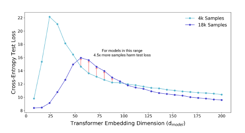
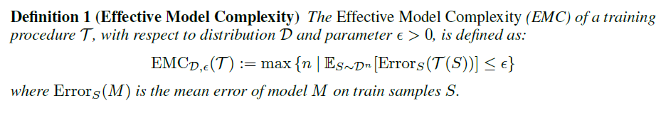
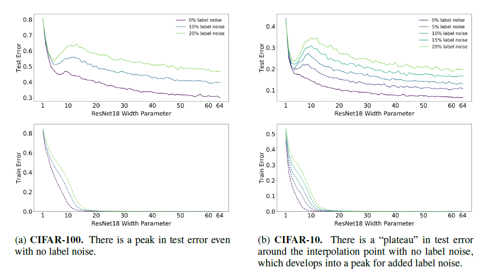

## TL;DR 
> 이 논문을 공부하는 사람에게 묻고 싶거나 강조하고 싶은 포인트는? 

- EMC란 개념 알아두고, 수업시간에 배운 Learning theory는 outdated일 수 있으니 deep double decsent나오면 진단 잘해야함. 여기까지가 논문의 내용이고 이후는 느낀 점들.
- Model/Data ablation 여러 번 하면서 의사결정의 근거로 활용할 수 있을 것 같음.
- 아직 심오한 수학적 근거는 없으니, 실제 엔지니어의 경험과 감을 믿어야겠고 inductive bias와 domain knowledge 잘 고려해봅시다.

## Line-by-Line 정리 
> 초기 리뷰를 마친 이후 개괄식으로 정리해보자!

```
1. 전통적인 논문에 따르면 언더피팅 이후 오버피팅. 근데 이게 SLT의 내용이라면, 오늘날의 DL은 그렇지 않은 경우가 많음. 과연 왜일까?
2. 저자들은 이를 address하기 위해 deep double descent를 주장함. 한마디로, 오버피팅되는것 같았으나 그 이후에 다시 에러가 줄어드는 구간이 있다는 것임.
3. 일반적으로 Training procedure는 여러 쿵짝이 잘 맞아야하는 스텝이기 때문에 EMC라는 것을 정의할 것.
4. EMC란? 주어진 모델 하에서 training error가 0이 될 수있게끔 하는 최대 샘플 수를 의미함.
5. EMC가 우리가 가진 데이터 샘플 수 N보다 현저히 작다면 이는 under-parameterized regime
6. EMC가 N보다 현저히 크다면 이는 over-parameterized regime 
7. EMC가 N과 비슷하다면 이는 critically-parameterized regime 
8. 이때 critical interval과 interpolation threshold라고 함.
9. Critical이 문제임. 여기서는 조금만 noise나 change가 일어나도 general structure가 깨지면서 문제가 심각해진다고 함. 그니깐 error가 커질 수도 있다는 것임. 
10. 반면 over-parameterized에선 interpolation model이 여러개라 괜찮다고 함.
11. critical regime은 lienar model에 대해서는 검증이 되었으나, DL model에 대해서는 open question.
12. 여기선 EMC를 model-based, epoch-based, sample-based의 3가지 관점에서 논함.
13. Model complexity가 있음. 특정 조건에선 model을 늘린다고 해서 error가 줄지 않음.  되려 늘 수 있음.
14. EMC를 늘릴 것 같은, 한마디로 학습을 어렵게 만드는 label noise / data aug 등은 loss는 낮출 수 있을지언정 전반적으로 peak도 그에 따라 이동함. 한마디로 capacity 더 큰 모델 필요하단 거겠지.
15. Epoch를 늘리면 일반적으로 EMC가 오른쪽으로 간다고 함. 그래서 over-parameter에서 under-parameter로 간다고 함. 
16. Sample을 늘리면 loss는 일반적으로 줄지만 peak가 오른쪽으로 이동함. 
```


## Initial Review

>  이제 직접 리뷰를 시작해보자!

## Abstract 

- 모델 크기나 에폭 수를 늘리면 처음엔 안 좋아지지만, 갈수록 좋아짐. 
- `Effective model complexity` 라는 measure를 이야기할 것!

## Introduction 

- `Bias-variance tradeoff`에 따르면, 일정 기간 학습시킨 이후에는 퍼포먼스가 줄어들어야함
	- 오버피팅되면서 Test-performance가 안 좋아진다고. 
	- 그러나, 사실 그렇지 않음.
	- 한마디로, `large models are better` 인 시대에 와있음!
- `Training time`에 대해서도 말이 분분함.
	- early stopping이 도움이 되는 경우도 있고, 끝까지 기다려야 되는 경우도 있음.
- 확실한건, `more data` is always better!
- `under-parametized` regime
	- model complexity가 샘플보다 적을 때는, Test-error가 우리가 알듯이 U자형 모양을 띰.

- `over-parametized` regime
	- model complexity가 충분히 커서 zero training error를 달 성할 때 즈음이면 
	- increasing complexity가 error를 줄임.

### Contribution 

- `EMC`(Effective model complexity) 
	- zero-training error를 달성하기 위한 최대 샘플 수 
	- Data dist'n과도 관련있고 clf arch랑도 관련 있고, training time과 관련있음. 
- 많은 경우 Double decsent는 EMC의 함수로 나타남.
	- Epoch-wise double decsent는 EMC의 함수이며 under-parametized stage에선 U자이고, EMC가 샘플수보다 훨씬 크면 성능이 좋아진다.
- Sample non-monotonocity
	- EMC가 sample number랑 거의 같아질 때(원문 = match될때) transition이 일어나면서 test error가 확 커짐.
	- 이 경우 데이터를 추가하는 것이 peak를 오른쪽으로 옮기는 효과가 있다고 함.
	- Figure 3에 제시되어있음.

	- 트포 모델을 늘릴수록, 피팅에 필요한 데이터가 더 필요함. 
	- 18K sample 은 loss는 일반적으로 더 낮지만 loss-peak가 더 오른쪽에 있음
		- 일부 모델의 경우 중간에 있는 영역대의 모델은 데이터가 많았는데도 문제가 된 것.


## Our results 



- 주어진 Dataset과 거기서 학습된 classifier $\tau(S)$ 가 있을 때 그 error가 zero-term이 되도록 만드는 최대 샘플수
	- SM: 직관적으로, 오버피팅이 될 수 있는 최대 샘플 수라는 것 같음.
- Under-parametized regime
	- EMC(T) << n이면, Training procedure에서 `effective complexity`를 늘리면 test error가 줄것.
- Over-parametized regime 
	- EMC(T) >> n이면, Training procedure에서 `effective complexity`를 늘리면 test error가 줄것.
- Critically-parametized regime
	- EMC(T) ~= n이면, Training procedure에서 `effective complexity`를 늘리면 test error가 줄 수도 있지만 늘 수도 있다.
- 이건 약간 informal한 이야기이기 때문에, sufficiently large/small (<<n, >>n)을 측정하긴 어렵다.
	- 확실한건, 그 임계점이 되는 `critical interval` 이란게 있고, 이 근처에서는 퍼포먼스가 오락가락한다.
	- 이 Width는 dist'n과 training procedure에 달려 있다.
- 그래서 다양하게 실험함.
	- model-wise double-descent : `arch` 실험(Dataset, Model arch, Optimizer, Train data samples, Trainings)
	- Epoch-wise double-descent : `Training longer can correct overfitting`
	- Sample-wise non-monotnonicity : 
		- model arch와 training procedure를 고정시키면, critical regime에서는 
			- long-plateau region이 가능함.
			- Peak로 나타날 수 있음. 
	- Laebl noise
		- training label noise가 있을 때 double decsent가 매우 강하게 관찰됌.


## Experimental setup 

- Arch: Three family
	- ResNet
		- width(num channels)
	- Standard CNN
		- 5-layer CNN with varying width
	- Transformers
- Loss / opt
	- Adam / SGD
- Label noise 

## 5. Model-wise double descent 



- 표를 보면 주어진 optimization이 끝난 이후의 train error / test error를 이용하여 결과를 비교한 것
- Interpolation threshold를 늘리는 일 
	- label noise / data aug/ train sample을 늘리는 것은 interpolation threshold의 증가
	- 동시에, test error의 peak를 larger model로 보냄.
		- SM: 더 많은 capacity를 가진 model이 필요하다는 뜻으로 받아들임.

#### Critically-paraemerized setup
- Interpolation threshold의 model-size에는 effective model이 1가지만 있음.
	- 다만 이게  train-set의 noise에 엄청  sensitive함!
	- 논문에서는, 잘 하고 있었는데 한두개만 삐긋해도 global structure가 어긋나기 때문에 에러가 확 커지는 것이라고 함.
- 앙상블이 도움이 될 수 있다고 함.
#### Over-paraemerized setup
-  여러 interpolation model이 있고, SGD가 전반적으로 dist'n에서 잘하면서도 noise를 absorb하는 걸 찾아낼 수 있는듯 하다.


## 6. Epoch-wise double descent 

- 학습시간을 늘리는 것을 EMC를 늘리는 것.
- 충분히 큰 모델도 double descent를 겪을 수 있음. 
- medium-sized model은 U-like curve를 겪고, small-sized model은 학습을 오래하면 test error가 줄 것.

(Conventional wisdom)
- Phase 1 : 네트워크가 small generalization gap을 가진 function을 학습함 
- Ph ase 2; 오버피팅으로 인해 test error 가 생김.
- (New!) Phase 3: 그게 다시 줄어들며 새로운 minimu

## 7. Sample-wise non-monotonocity 
- 위의 2가지 내용이 critical regime의 일이라면, 이번에는 train sample $n$ 을 건드려보는 것 
- n을 늘리면, over-parametized -> under-parametized
	- 그러나 동시에 peak도 오른쪽으로 옮겨감!
- 이 critical zone을 벗어나면, 더 많은 데이터는 도움이 됌.


## 8. Conclusion 

- Model과 Training procedure는 EMC ~= training_samples인 특이사항일 때 일반적이지 않은 겨양을 보인다.
- Model-wise double decsent
	- Bigger model can perform worse.
	- compexity가 올라간 모델들의 최종 noise를 두었을 때, 특정 complexity에 이르기까지는 복잡하게 만들수록 더 최적화가 안되는 구간이 존재한다.
	- 즉, `bigger models can perform worse`
- Epoch-wise double descent 
	- 학습 시간을 늘리는 것에서도 이런 현상이 일어남.
- Sample-wise non-monotonocity
	- train sample을 늘리면 peak도 오른쪽으로 옮겨가기에, 늘 도움이 되는 것은 아님.